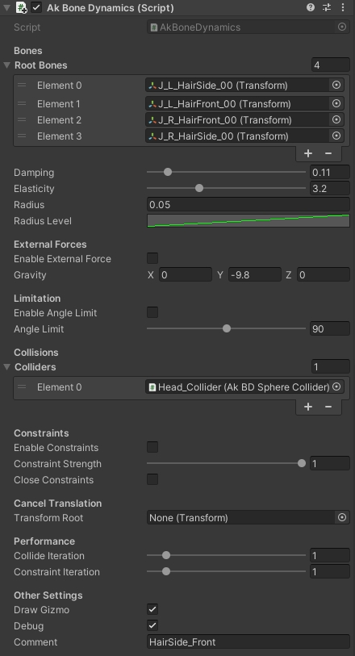
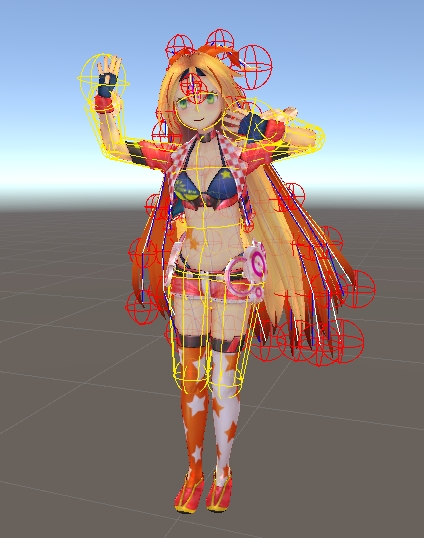
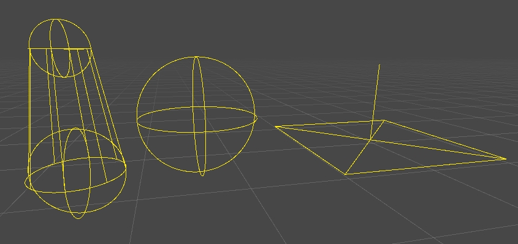

## AkBoneDynamics
  

Simple bone dynamics for easy setup.  
This project is for learning and experimental purposes. Please note that it is not designed to be implemented as-is in games, etc. 

  

## .Assets/AkBoneDynamics/
|Script|Category|Description|
|---|---|---|
|**AkBoneDynamics.cs**|Core|One is required per bone group. Can be attached to any GameObject.|
|**AkBoneDynamicsLight.cs**|Core|Constraint and Angle Limit removed from `AkBoneDynamics.cs`|
|**AkBDSphereCollider.cs**|Collider|Sphere Collider. Attach to GameObject want to collider.|
|**AkBDCapsuleCollider.cs**|Collider|Capsule Collider. Attach to GameObject want to collider.|
|**AkBDPlaneCollider.cs**|Collider|Infinite Plane Collider. Attach to GameObject want to collider.|
|**AkBDCollider.cs**|Base class|Base class for all colliders.|

### Inspector
  

### Gizmos / Debug
  

### Supported colliders
  

## References
* [Advanced Character Physics by Thomas Jakobsen](http://www.cs.cmu.edu/afs/cs/academic/class/15462-s13/www/lec_slides/Jakobsen.pdf)  
* [Position Based Dynamics by Matthias Müller, Bruno Heidelberger, Marcus Hennix, John Ratcliff](https://matthias-research.github.io/pages/publications/posBasedDyn.pdf)  
* [Position Based Dynamics Combo 物理シミュレーション関連の最新論文実装](https://github.com/nobuo-nakagawa/cedec2017)  
